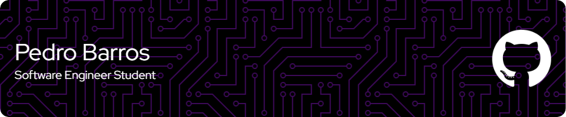

## Sobre 📝

### Desenvolvedor Front-end 💻 e Estudante de Engenharia de Software na PUC Minas 📔

Oi, me chamo Pedro tenho 19 anos e sou apaixonado por tecnologia. Por conta disso me tornei um desenvolvedor e estudo Engenharia de Software. 
Hoje, sou especificamente um desenvolvedor Front-end, mas possuo competências em outras áreas também.

